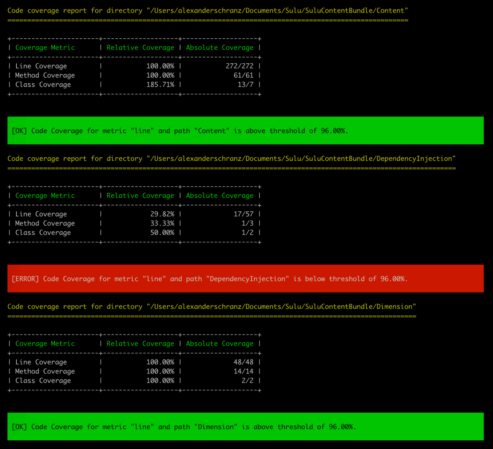

# Code Coverage Checker ⛰

[](https://github.com/handcraftedinthealps/code-coverage-checker/blob/master/LICENSE)
[](https://github.com/handcraftedinthealps/code-coverage-checker/releases)

A code coverage checker for phpunit.

## Installation

```bash
composer require handcraftedinthealps/code-coverage-checker --dev
```

## Usage

### Generate coverage

```bash
phpunit --coverage-php "Tests/reports/coverage.php"
```

### Check coverage

```bash
vendor/bin/code-coverage-checker "Tests/reports/coverage.php" "line" "96.0"
```

Instead of `line` you can use `class` or `method`.
You can also check only specific directories:

```bash
vendor/bin/code-coverage-checker "Tests/reports/coverage.php" "line" "96.0" "Directory/A" "Directory/B"
```

### Example Output


